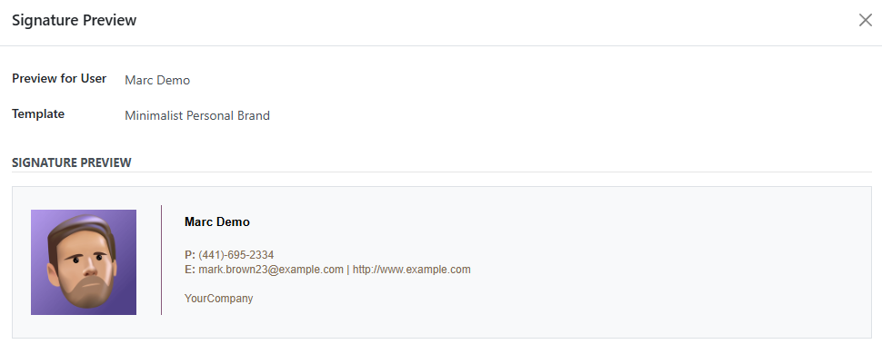
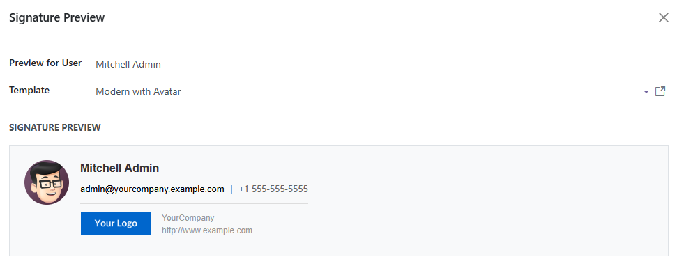

For users:

1.  Go to your user preferences (click your name in the top right \>
    Preferences)
2.  In the "Email Signature" section, choose whether to use a signature
    template
3.  Select your preferred template from the dropdown
4.  Click "Preview" to see how your signature will look
5.  Save your preferences

For administrators:

1.  Create and manage templates from **Settings \> Technical \> Email \>
    Signature Templates**
2.  View which users are using each template by clicking the user count
    on any template
3.  Set company-wide defaults and policies in company settings
4.  Monitor template usage through the template list view

The signature will automatically update in all outgoing emails once
configured.

**UTM Tracking:**

Templates support automatic UTM parameter tracking for links:

- UTM tracking is enabled by default on all templates
- Default parameters: `utm_source=email-signature`, `utm_medium=email`
- User-specific tracking with `utm_content=user-{id}`
- Configure custom UTM campaigns per template
- Disable UTM tracking by unchecking "Use UTM Tracking" in template settings

**Image Support:**

- Supports all major image formats: PNG, JPEG, GIF, SVG, WebP, BMP, ICO
- Automatic format detection for company logos and user avatars
- SVG logos are properly served with `image/svg+xml` content type
- Gmail-compatible public image URLs that work with email proxies
- Images are served from `/mailcdn/` endpoints without authentication

**Social Media Links:**

- Integrates with the `social_media` module for company social media links
- Supports Twitter/X, Facebook, LinkedIn, Instagram, YouTube, and GitHub
- Uses Odoo's `/website/social/<platform>` routes for built-in tracking
- Social media links automatically include UTM tracking when enabled
- Configure social media URLs in company settings
- Templates can display social media icons with clickable links
